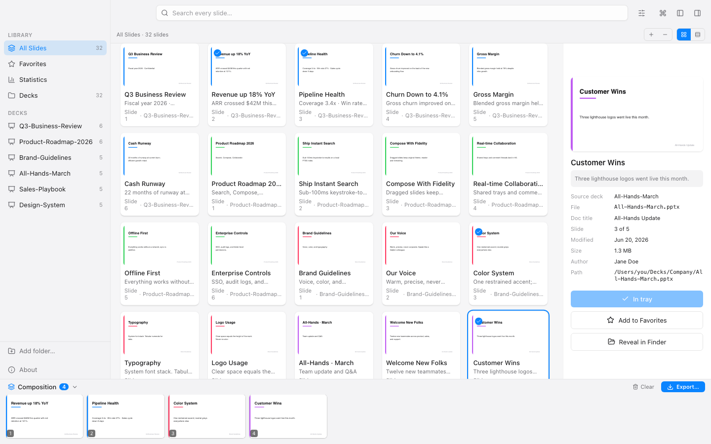
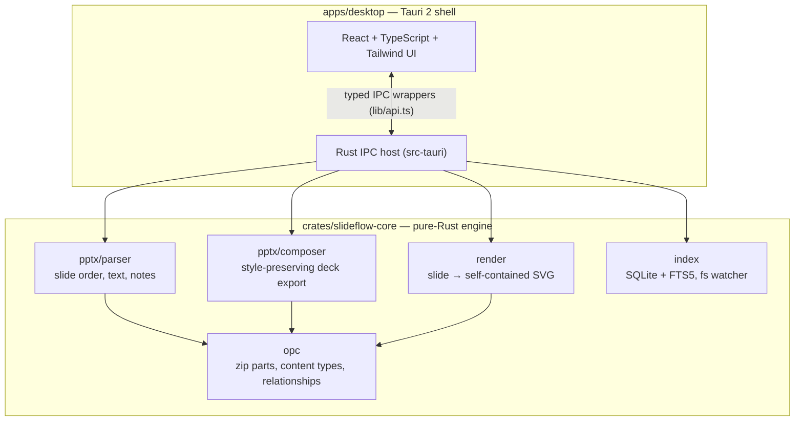

<div align="center">


# Slideflow

**Every slide you ever made, one keystroke away.**

[](https://github.com/michaelseliger/slideflow/actions/workflows/ci.yml)
[](LICENSE)
[](https://github.com/michaelseliger/slideflow/releases/latest)
[](#architecture)

[Website](https://slideflow.app) · [Download](https://github.com/michaelseliger/slideflow/releases/latest) · [Design overview](DESIGN.md) · [Report a bug](https://github.com/michaelseliger/slideflow/issues)

<picture>
  <source media="(prefers-color-scheme: dark)" srcset="docs/assets/screenshot-dark.png" />
  
</picture>

</div>

---

Slideflow turns the scattered pile of PowerPoint files on your machine into a
single, instantly searchable library of *individual slides* — and lets you drag
any of them into a tray to compose a brand-new deck, where every slide keeps the
**exact look, layout, master, and theme** it had in its source file.

It's a local-first desktop app for **macOS, Windows, and Linux**. No cloud, no
accounts, no telemetry — your slides never leave your computer. All PPTX
handling is **pure Rust**: no LibreOffice, no bundled Python, no conversion
APIs.

## Download

Get the latest version for your platform:

- **[slideflow.app](https://slideflow.app)** — direct downloads for every platform
- **[GitHub Releases](https://github.com/michaelseliger/slideflow/releases/latest)** — installers for the latest release:
  - **macOS** — `.dmg` (Apple Silicon + Intel)
  - **Windows** — `.msi` / `.exe`
  - **Linux** — `.deb` / `.AppImage` / `.rpm`

> [!NOTE]
> Builds are currently **unsigned**. On macOS you may need to right-click the
> app and choose *Open* the first time to bypass Gatekeeper.

## Why Slideflow

If you present for a living, your best slides already exist — they're just
trapped inside dozens of old decks, in folders you'll never remember to open.
The one chart, the one architecture diagram, the one pricing table you nailed six
months ago is somewhere on disk, and finding it means opening file after file.

Slideflow fixes that:

- **Find any slide in seconds.** Full-text search across every slide's title,
  deck name, body text, and speaker notes — you search the way you think
  ("pricing", "roadmap", "that Zürich map").
- **Reuse without the reformatting.** Most tools that merge slides flatten them,
  dropping source layouts, masters, and themes so your reassembled deck looks
  broken. Slideflow copies each slide's *complete* style chain, so composed decks
  look **exactly** like their sources — every time.
- **Stay in control of your files.** Everything runs natively on your machine.
  No LibreOffice, no bundled Python, no paid conversion APIs, no server.

## Features

**Search & browse**
- Full-text search across title, deck name, body text, and speaker notes.
- Smart matching — prefix matching (`road` → `roadmap`), diacritic-insensitive
  (`zurich` finds `Zürich`), with highlighted snippets and relevance ranking.
- Live slide previews rendered straight from the slide — theme colors,
  placeholder inheritance, and embedded images intact.
- Peek modal, inspector, and grid / group-by-deck views with adjustable
  thumbnail density.
- Favorites that survive re-indexing.

**Compose & export**
- Drag-to-tray composition — pull slides from anywhere into a persistent tray,
  reorder them, and export a new `.pptx`.
- Fidelity-preserving export — each slide brings its full style chain; shared
  masters, themes, and media are deduplicated automatically.
- Undo/redo on the tray; the tray is saved and restored on relaunch.
- Moved or changed source decks get a warning badge instead of silently
  vanishing.

**Library management**
- Incremental indexing — unchanged files are skipped, deleted files fall out, and
  a filesystem watcher picks up changes live.
- Background scanning with a live progress counter.
- Statistics view — index runs, searches, and export activity.

**Feel**
- Native window chrome, dark mode, a command palette (`⌘K`), and a keyboard-first
  layout.

## How to use

1. **Add your folders.** Point Slideflow at the folders where your `.pptx` files
   live. It scans them in the background and indexes every slide — you'll see a
   live counter as it works.
2. **Search.** Type what you're looking for. Slideflow searches slide titles,
   body text, speaker notes, and deck names, and shows live previews of every
   match. Press `space` to peek at a slide full-size.
3. **Pick slides.** Drag any slide into the tray, or press `return` to add the
   selected one. Reorder the tray however you like; add slides from as many
   different decks as you want.
4. **Export.** Press `⌘E` to export the tray as a brand-new `.pptx`. Every slide
   keeps its original formatting, so the new deck opens cleanly in PowerPoint or
   Keynote.

**Handy shortcuts:** `⌘F` search · `space` peek · `return` add to tray ·
`⌘E` export · `⌘R` re-index · `⌘Z` / `⌘⇧Z` undo/redo · `⌘K` command palette.

## Command line

Slideflow ships a companion `slideflow` command for driving your library from the
terminal — index folders, search (full advanced syntax, `--json` output),
compose decks, render slides, and print stats, all without opening the app.

**Install it from the app:** open **Settings → Advanced → Command line tool** and
pick *Install system-wide* (links `/usr/local/bin/slideflow`; may ask for your
password) or *Install for me only* (links `~/.local/bin/slideflow` and adds it to
your shell `PATH`). The command links to the CLI **bundled inside the app**, so it
updates along with Slideflow. Open a new terminal, then:

```bash
slideflow index ~/Documents/Decks                    # scan a folder into a library db
slideflow search "pricing" --json                    # advanced-syntax search, JSON out
slideflow compose out.pptx deck.pptx:3 talk.pptx:1   # compose, preserving each slide's format
slideflow render deck.pptx 2 slide.svg               # one slide → self-contained SVG
slideflow stats                                      # library totals & recent activity
slideflow --help                                     # full command + flag reference
```

By default the CLI uses the **desktop app's library**, so `search`/`stats` query
exactly what the app indexed and `index` adds to it — you don't need to know
where the app is installed. Pass `--db <path>` to point at a separate database
instead. Building from source? `cargo install --path crates/slideflow-cli`
installs the same binary.

## Privacy

**Slideflow is local-first and offline by design. Your slides never leave your
machine.**

- **No cloud, no accounts, no telemetry.** There is no server and no sign-in;
  nothing is uploaded. All parsing, search, preview rendering, and deck
  composition run natively on your computer.
- **Everything stays on disk, under your control.** The search index lives in a
  local database, previews are cached locally, and preferences live in the app's
  local store. Deleting the index fully resets it.
- **Least-privilege by default.** The app ships a tight capability set and a
  strict Content-Security-Policy — the interface can't phone home even if it
  wanted to.

You point Slideflow at folders you already own, and that's the entire trust
boundary.

## Architecture

Slideflow is two layers in **two separate Cargo workspaces**:



- **`crates/slideflow-core`** — the engine: PPTX parsing, the SQLite/FTS5
  search index + file watcher, the slide→SVG renderer, and the style-preserving
  deck composer. No GUI, no GTK/WebKit, no OS dependency — it builds and tests
  anywhere.
- **`apps/desktop`** — the Tauri 2 shell (React + TypeScript + Vite + Tailwind
  frontend, thin Rust IPC host) that drives the engine.

The Tauri host at `apps/desktop/src-tauri` is intentionally excluded from the
root workspace, so `cargo test` at the repo root — and the `core` CI job — runs
on plain Linux/macOS/Windows without any GTK/WebKit system libraries.

The composer's core invariant is what makes exports pixel-faithful: every copied
slide brings its **complete relationship closure** (layout → master → theme →
media → charts) plus presentation-level parts, with identical parts across
picks deduplicated by content hash.

| Engine module | What it does |
| --- | --- |
| `opc` | Open Packaging Conventions layer: zip parts, `[Content_Types].xml`, relationships |
| `pptx/parser` | Slide order, text, speaker notes, metadata extraction |
| `pptx/composer` | Builds new decks from picked slides, preserving each slide's full style chain |
| `render` | Slide → self-contained SVG previews (theme colors, placeholder inheritance, embedded images) |
| `index` | SQLite + FTS5 library: incremental scanning, ranked full-text search, filesystem watcher |
| `model` | Serde domain types shared with the frontend |
| `fixtures` | Programmatic minimal-but-valid PPTX builders for tests |

## Building from source

### Prerequisites

- **Rust** stable, via [rustup](https://rustup.rs).
- **Node 22** and **pnpm 11** (`npm i -g pnpm@11`, or Corepack: `corepack enable`).
- **macOS:** Xcode Command Line Tools (`xcode-select --install`). Tauri uses the
  system WebKit (`WKWebView`) — no bundled Chromium.
- **Linux (to build/run the desktop app):** the Tauri 2 system libraries —
  `libwebkit2gtk-4.1-dev`, `libappindicator3-dev` (or
  `libayatana-appindicator3-dev`), `librsvg2-dev`, `patchelf`, plus the usual
  `build-essential`, `libxdo-dev`, `libssl-dev`. (Not needed just to test the
  engine crate.)

### Setup & dev loop

```bash
git clone https://github.com/michaelseliger/slideflow && cd slideflow
git config core.hooksPath .githooks # enable the pre-commit hook (clippy + engine tests)
cargo test -p slideflow-core        # verify the engine builds + passes

cd apps/desktop
pnpm install                        # install frontend deps
pnpm tauri dev                      # full native app, hot-reloading frontend

# Frontend only, in a plain browser — falls back to an in-memory mock library
# (~40 slides), so the whole UI is clickable at http://localhost:1420:
pnpm dev
```

### Tests

```bash
# Engine unit + integration tests (this is what CI gates on):
cargo test -p slideflow-core

# Optional: run the large-file end-to-end test against a real corpus:
SLIDEFLOW_CORPUS=~/Documents/Decks cargo test -p slideflow-core --test e2e
```

### Production build

```bash
cd apps/desktop
pnpm tauri build     # native bundle for the current OS
```

Artifacts land in `apps/desktop/src-tauri/target/release/bundle/` (e.g.
`macos/Slideflow.app`, `dmg/Slideflow_<version>_aarch64.dmg`).

See [`apps/desktop/README.md`](apps/desktop/README.md) for app-specific details
(data locations, keyboard map, frontend-only browser mode, packaging) and
[`DESIGN.md`](DESIGN.md) for the full product & design overview.

### CI & releases

Two GitHub Actions workflows live in `.github/workflows/`:

- **`ci.yml`** (every push / PR): builds + tests `slideflow-core` on Linux,
  macOS and Windows, type-checks and builds the frontend, and runs `clippy`
  (currently non-blocking).
- **`release.yml`** (push a `v*` tag, or run manually): builds installable
  bundles on every platform and, for a tag push, attaches them to a **draft**
  GitHub release — macOS `.dmg` (Apple Silicon + Intel), Linux
  `.deb` / `.AppImage` / `.rpm`, and Windows `.msi` / `.exe`. Artifacts are
  unsigned (no code signing / notarization configured yet).

To cut a release: `git tag v0.2.1 && git push origin v0.2.1`, then publish the
drafted release once the bundles are attached.

## Contributing

Issues and pull requests are welcome — for anything non-trivial, please open an
issue first so we can discuss the approach.

Before submitting a PR:

```bash
cargo clippy -p slideflow-core --all-targets -- -D warnings   # must be lint-clean
cargo test -p slideflow-core                 # engine tests must pass
cd apps/desktop && pnpm build                # frontend must type-check + build
```

The first two run automatically on commit if you enabled the hooks path above
(`git config core.hooksPath .githooks`).

The engine has no GUI dependencies, so you can hack on parsing, search,
rendering, or composition from any OS without a Tauri toolchain.

## License

Slideflow is open source under the **[MIT license](LICENSE)** — read it, fork
it, build it, ship it.

## Acknowledgements

Built on the shoulders of [Tauri](https://tauri.app),
[SQLite FTS5](https://sqlite.org/fts5.html) (via
[rusqlite](https://github.com/rusqlite/rusqlite)),
[quick-xml](https://github.com/tafia/quick-xml) /
[roxmltree](https://github.com/RazrFalcon/roxmltree), and the wider Rust crates
ecosystem.
